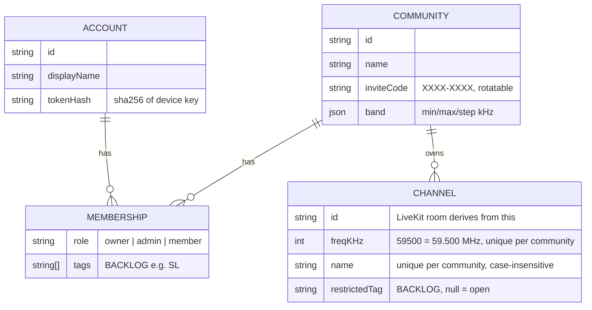
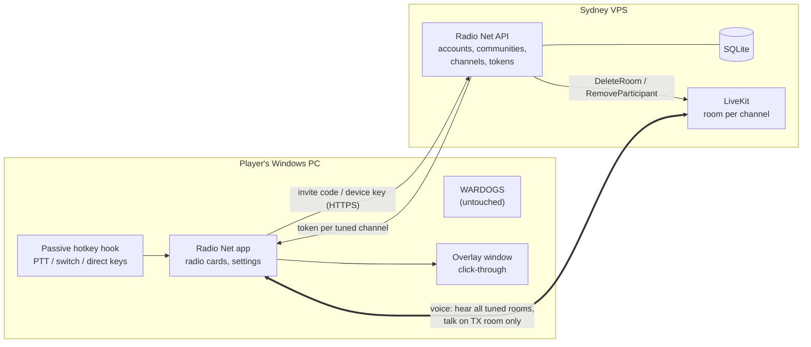

# Radio Net: scope and plan (v0.2)

*Updated Fri 9 Oct 2026, ~4:40pm NZT. v0.1 assumed fixed nets and Discord roles. v0.2 follows Tobias's answers: **frequency/name channels created in the app**, **no Discord dependency** (Discord moves to the backlog).*
*Provider comparison: [`providers.md`](providers.md) (unchanged). UI direction: [`UI.md`](UI.md) + [`mockup.html`](mockup.html). M1 spike: [`spike/README.md`](../spike/README.md).*

## 1. The one-paragraph version

**Radio Net** (working name) is a small **Windows desktop app** that runs beside WARDOGS or any game. A group creates a **community** in the app and shares an **invite code**; members join with the code and a display name. No Discord, email or password. Community **admins create and delete channels**, each a **frequency + name** (e.g. `59.500 Command`). Every user has their own **radio**: tune any number of channels to **listen** (type `59.5` or `command`), each with its own **volume and left/centre/right ear**, and pick **one to transmit** on. **Push-to-talk** talks on the TX channel; a **switch key** (Reforger's G) cycles TX through your tuned channels; optional **direct keys** talk on a specific channel. A click-through **overlay** is on by default: a small box in a screen corner that stays empty when nobody is transmitting, and while someone transmits shows only their display name and the channel (frequency + name) they are transmitting on, stacked if several people are talking. Voice runs on **self-hosted LiveKit** in Sydney. Clean voice, no radio effects.

## 2. What changed from v0.1

| Area | v0.1 | v0.2 |
|---|---|---|
| Channels | Fixed nets (Command/Arty/Logi/FT-1..4) in a server config file | **Admins create/delete channels in-app**: frequency (30.000–87.975 MHz, 25 kHz steps) + name. Fireteams are just ad-hoc frequencies. |
| Who hears what | Discord roles per net | **MVP: anyone in the community can tune and talk on any channel.** Per-channel restriction is backlog. |
| Accounts | Sign in with Discord | **Own lightweight accounts: invite code + display name → device key** (see §4). Discord login is backlog. |
| Admins | Discord roles | **Owner** (creator of the community) promotes **admins**. Admins: create/delete channels, rotate invite, remove members. |
| Discord dev app | Needed for M2 | **Not needed for MVP.** [`discord-setup.md`](discord-setup.md) kept for later. |

## 3. Data model

- **Frequencies are stored as integer kHz** (no float bugs). Input accepts `59.5`, `59.500`, `59.5 MHz`, `59500`. Default band 30.000–87.975 MHz in 25 kHz steps (like military VHF sets). Configurable per community.
- **User radio state stays on the client** (per community: tuned channel ids, TX channel, per-channel volume/pan/mute, keybinds). The server doesn't need it. Syncing it across PCs is backlog.
- **Storage:** SQLite on the VPS for M2 (one file, nightly backup). The spike uses an in-memory store behind the same interface.

## 4. Accounts without Discord (decision)

**Picked: invite code + display name → per-device secret key.**

1. Owner creates a community (needs a **server setup code** we set on the VPS, so strangers can't use our server).
2. They share the invite code (`K7QM-2XPA`) in their Discord/WhatsApp.
3. A member types the code + a callsign. The server creates an account and returns a **random 256-bit device key** once. The app stores it in **Windows' encrypted storage** (DPAPI via Electron `safeStorage`). The server stores only its SHA-256 hash.
4. Every request uses that key as a bearer token. One account can be in several communities.

**Why this over the alternatives:**
- **Email magic link** needs an email provider sign-up, deliverability and a mail template, plus friction for gamers. Not worth it for one small group.
- **Username + password** means password hashing, resets and "I forgot my password" with no email to reset to. More code and more support for no real gain.
- **Invite code + device key** is one screen and zero third parties. It's as strong as the key (256-bit, never typed). The invite code is only a door: joins are **rate-limited** per IP, admins can **rotate** it, and can **remove** anyone (who is also dropped from voice immediately).
- **Trade-offs (accepted):** a new PC = rejoin with a new account (backlog: admin-issued one-time **recovery code** to move an account). Display names aren't unique. Admins can see who's who.

## 5. Server API (Node/TypeScript + Fastify; spike implements all of these)

| Method | Path | Who | What |
|---|---|---|---|
| POST | `/api/communities` | anyone with setup code | Create community; caller = owner. First-time users pass `displayName` and get their device key back. |
| POST | `/api/join` | anyone (rate-limited) | `{inviteCode, displayName}` → membership (+ device key if new). |
| GET / PATCH | `/api/me` | signed in | My account + communities (+ invite code if admin) / change display name. |
| POST | `/api/communities/:cid/invite/rotate` | admin | New invite code; old one stops working. |
| GET | `/api/communities/:cid/members` | member | Member list with roles. |
| PATCH | `/api/communities/:cid/members/:aid` | owner | Make admin / member. |
| DELETE | `/api/communities/:cid/members/:aid` | admin (or self = leave) | Remove member + kick from all voice rooms. |
| GET | `/api/communities/:cid/channels` | member | Channel list, sorted by frequency. |
| GET | `/api/communities/:cid/channels/resolve?q=` | member | `59.5` / `41.250 MHz` / `command` / unique prefix `comm` → channel. |
| POST | `/api/communities/:cid/channels` | admin | `{freq, name}`. 409 if frequency or name already used. |
| DELETE | `/api/communities/:cid/channels/:chid` | admin | Delete + LiveKit `DeleteRoom` (everyone tuned is dropped). |
| POST | `/api/communities/:cid/radio/tokens` | member | `{channelIds[]}` → one LiveKit token per channel. |

Backlog: a push channel (SSE/WebSocket) so channel list changes appear instantly. MVP polls every 10 s.

## 6. How channels map to LiveKit (decision)

- **1 channel = 1 LiveKit room**, named `g{communityId}.ch{channelId}`. Keyed on the channel **id**, so deleting `59.500` and recreating it later gives a fresh, empty room.
- The client opens **one LiveKit connection per tuned channel** (tested with 2 rooms per client; up to 16 allowed by the API). Each room's audio goes through its own **gain + stereo-pan** node.
- **Token grants per room:** `roomJoin`, `canSubscribe: true`, `canPublish: true` **microphone only** (`canPublishSources: [microphone]`), `canPublishData: false`, 10-minute join TTL.
- **Transmit:** the app pre-publishes a **muted** mic track in each tuned room. PTT **un-mutes only the TX room**. Changing TX (switch key) is instant: no reconnect, no renegotiation.
- **What the server enforces vs the client:** the server enforces *who may* hear/talk on a channel (tokens), and that only mic audio can be sent. "Only one TX at a time" is a UX rule enforced by the app. That's fine while everyone can talk everywhere. When restricted channels arrive (backlog), the token simply won't grant publish/subscribe on them. Spike proves LiveKit refuses to publish with a listen-only token.

## 7. Client UX (see [`UI.md`](UI.md), [`mockup.html`](mockup.html))

- **First run:** "Join your net" (invite code + callsign) or "Create a community" (name + setup code).
- **Main window:** community rail (left) → community's channel list with a **Tune** box ("59.5 or Command", Enter) and admin **+ New / delete** → **radio** area: a big **"Transmit on 59.500 Command"** bar (turns red "On air" while keyed) and a **card per tuned channel**: frequency, name, who's talking, volume + mute, **L/C/R ear**, "Transmit here", untune ×.
- **Keys (defaults, all rebindable, mouse buttons OK):** PTT `Mouse 4`, switch `Mouse 5` (or `G`), hide overlay `F10` (the overlay is on by default), optional direct key per channel. Confirmation blips on key-up/down and switch (not a radio effect; can be turned off).
- **Overlay:** always on by default. A small click-through box in a screen corner. It draws nothing while nobody is transmitting. When someone transmits, it shows only that person's display name and the channel they are transmitting on (frequency + name, for example `Rhys  59.500 Command`). Several talkers stack, one line each.
- **Remembers** tuned channels, TX channel, volumes per community. Tray icon, start minimised, auto-reconnect.

## 8. Stack (unchanged except auth)

Self-hosted **LiveKit** (Sydney VPS, Docker, auto-HTTPS) · **Electron + React + TypeScript** with `livekit-client` · **uiohook-napi** passive global hook · overlay = transparent, click-through, non-focusable, always-on-top window · **Fastify** API + **SQLite** · Opus with DTX + RED, browser echo cancellation / noise suppression / auto-gain · NSIS installer + self-hosted auto-update. Reasons in v0.1 §3 still apply (see git history / `providers.md`).

## 9. Milestones (revised)

| # | Milestone | What Tobias sees | Effort (dev days) | Status |
|---|---|---|---|---|
| M0 | Setup | Plan agreed, private repo (on his OK), domain chosen | ½ | Waiting on repo OK + domain pick |
| M1 | **Spike + anti-cheat gate** | Working core on Linux (done, see §11). **Still to do on Windows:** two testers, WARDOGS focused, PTT + switch work, overlay visible over borderless WARDOGS, **no anti-cheat complaint**. | 3–4 | **~70% done** (Linux part) |
| M2 | Real backend | Sydney VPS: LiveKit + API + SQLite, HTTPS on our domain, setup code, backups | 2–3 | |
| M3 | Pleasant UI | Mockup made real: keybind recorder, device picker + mic test, settings, tray, member/admin screens, invite rotate | 4–6 | |
| M4 | Overlay + polish | Overlay position/size/opacity, reconnects, installer, auto-update | 3–4 | |
| M5 | Test nights | 1–2 evenings with the group, fix-up pass | 2–3 | |
| | **Total** | | **~15–20 dev days ≈ 3–5 weeks part-time** | |

Dropping Discord login saves about a day in M2. In-app channel management adds about a day in M3. Net effect is roughly the same timeline.

## 10. Running cost (Tobias pays)

| Item | Cost | Notes |
|---|---|---|
| Sydney VPS (1–2 vCPU, 2–4 GB) | ~US$10–20/mo (≈ NZ$18–36) | LiveKit + API on one box |
| Domain | ~NZ$19–25/yr | See [`naming.md`](naming.md). Not bought. |
| LiveKit Cloud (fallback) | US$0 dev / US$50 mo real use | Only if self-hosting is a hassle |
| Code signing | skip for now | SmartScreen "Run anyway" note for friends |

## 11. M1 spike results (Fri 9 Oct, on the Linux box)

See [`spike/README.md`](../spike/README.md) for how to run it.

**Proven (automated, all passing):**
- API unit tests: **13/13**. Frequency parsing/validation, create/delete/list/resolve channels, duplicate freq/name → 409, admin-only actions, invite join (any case/format), invite rotation, owner promotes admin, kick, multiple communities per account, join rate-limit, setup-code gate, token grants (correct room, subscribe, mic-only publish, no data).
- Headless voice test with 4 bot "players" on a real local LiveKit server: **14/14**. Multi-room connect, listen-many/talk-one (audio arrives only on the TX channel), switch TX between channels, listen-only token can't publish (server-enforced), non-admin can't create channels, deleting a channel drops everyone tuned to it while other channels stay up. Key-up to first audio ~47 ms on localhost (not a real-world number).
- **The real Electron app** on a virtual Linux display with a fake mic, plus a bot: **8/8**. Join by invite code, tune by `59.5` and by `arty`, remote speaker shown on the right card, **global PTT via the uiohook mouse hook** (Mouse 4) keys up, **its audio reaches the bot on Command only**, release un-keys, **switch key (Mouse 5) moves TX to Arty** and audio follows. That run's overlay still drew a persistent TX line plus speakers. The overlay was changed after that run to match the decision in §7 (on by default, hidden until someone transmits, each line is display name plus channel). The Electron smoke test was not re-run after that change.

**Not verified (needs Windows and/or real people):**
- **Elytra anti-cheat** tolerance of the hook + overlay. This is the M1 gate.
- Hotkeys while **WARDOGS has focus** on Windows (and the "game run as admin" case).
- Overlay over **borderless WARDOGS** (Linux had no compositor, so true transparency wasn't checked).
- Real microphones: echo cancellation/noise suppression quality, headset vs speakers, per-ear pan by ear.
- Real network NZ → Sydney latency and packet loss. Load beyond ~5 participants.
- Windows install/SmartScreen, DPAPI token storage (code is there, untested on Windows).

**Known issues found:** Electron sometimes hangs on quit in the test harness (likely uiohook shutdown). Needs a fix in M3. In the test, a speaker can stay shown as "talking" briefly after they stop (bot doesn't send silence; real clients do, so probably fine but worth watching).

## 12. Backlog / TODO

- [ ] **Choose final app name** (ideas + domains in [`naming.md`](naming.md))
- [ ] Buy domain (Tobias's OK + card)
- [ ] **Per-channel restriction** (e.g. only members tagged `SL` can tune/talk on Command), plus listen-only channels
- [ ] **Discord integration (optional):** "Sign in with Discord", link a community to a Discord server, map roles → tags. See [`discord-setup.md`](discord-setup.md)
- [ ] Account recovery / move to a new PC (admin-issued one-time code)
- [ ] Live channel-list updates (SSE) instead of 10 s polling
- [ ] "Transmit on all tuned channels" key; priority/ducking (Command louder)
- [ ] Channel presets per op (one click tunes a set)
- [ ] Sync radio state across PCs
- [ ] Code signing if SmartScreen puts people off
- [ ] Mac/Linux builds; phone listen-only
- **Explicitly out:** radio effects, range/terrain simulation, anything that reads or hooks the game.

## 13. Questions for Tobias (short)

1. **OK to create a private GitHub repo** `radio-net` for the code and these docs? (A yes is enough.)
2. **Name/domain:** pick from [`naming.md`](naming.md) or say "keep Radio Net" (`radionetvoice.com`). I won't buy anything.
3. **Windows testers:** two people (you + one) for a short M1 test night. Happy to risk one WARDOGS account first?
