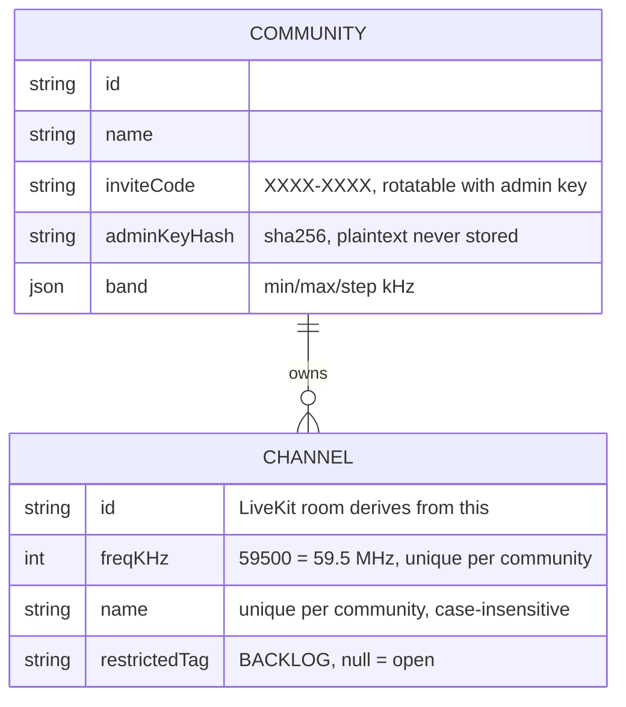
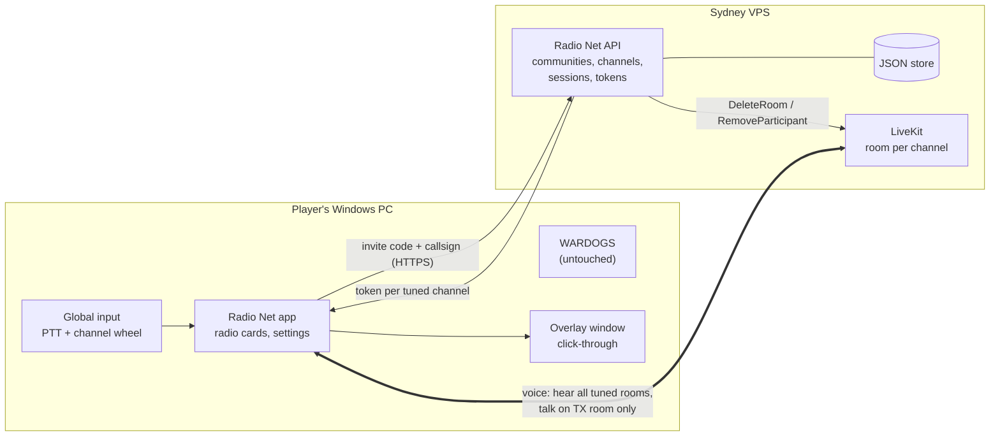

# Radio Net: scope and plan (v0.2)

*Updated Fri 9 Oct 2026. v0.1 assumed fixed nets and Discord roles. v0.2 follows Tobias's answers: **frequency/name channels created in the app**, **no Discord dependency**, and **no user accounts** (a callsign and server list live on the PC).*
*Provider comparison: [`providers.md`](providers.md) (unchanged). UI direction: [`UI.md`](UI.md) + [`mockup.html`](mockup.html). M1 spike: [`spike/README.md`](../spike/README.md). Sydney deploy kit: [`../deploy/README.md`](../deploy/README.md). Anti-cheat notes: [`anticheat-and-contacts.md`](anticheat-and-contacts.md).*

## 1. The one-paragraph version

**Radio Net** (working name) is a small **Windows desktop app** that runs beside WARDOGS or any game. The first launch asks for a **callsign**, stored on that PC. A group creates a **community** and shares an **invite code**; members join that server with the code. No Discord, email, password, or account. The creator gets a **community admin key** (also stored on the PC, and shareable) which is required to create or delete channels and to rotate the invite. Each channel is a **frequency + name** (e.g. `59.5 Command`). Every user has their own **radio**: tune any number of channels to **listen** (type `59.5` or `command`), each with its own **volume and left/centre/right ear**, and pick **one to transmit** on. **Push-to-talk** talks on the TX channel. A **channel-wheel** hotkey (default `G`, Arma Reforger style) opens a radial menu centred on the screen. Hover a segment, left-click to make it the transmit channel, right-click to mute or unmute, scroll to step that frequency by 0.5 MHz (30.0–87.5 MHz), Shift+scroll to change that channel’s volume, and use the **+** segment to add a channel by frequency or name. The wheel takes mouse focus briefly. The fallback, which does not need that focus, is hold `G` and scroll or press a number key. Release or Esc closes. Push-to-talk stays its own key. See [`radial-wheel.png`](radial-wheel.png). A click-through **overlay** is on by default: a small box in a screen corner that stays empty when nobody is transmitting, and while someone transmits shows only their display name and the channel (frequency + name) they are transmitting on, stacked if several people are talking. Voice runs on **self-hosted LiveKit** in Sydney. Clean voice, no radio effects.

## 2. What changed from v0.1

| Area | v0.1 | v0.2 |
|---|---|---|
| Channels | Fixed nets (Command/Arty/Logi/FT-1..4) in a server config file | **Admins create/delete channels in-app**: frequency (30.0–87.5 MHz, 0.5 MHz steps) + name. Fireteams are just ad-hoc frequencies. |
| Who hears what | Discord roles per net | **MVP: anyone in the community can tune and talk on any channel.** Per-channel restriction is backlog. |
| Accounts | Sign in with Discord | **No accounts.** Callsign, keybinds, server history, volumes and overlay prefs stay in Electron userData on that PC (see §4). |
| Admins | Discord roles | **Admin key** returned once when the community is created. The server stores only its hash. Create/delete channels and invite rotation require the key. The server setup code can mint a replacement. |
| Discord dev app | Needed for M2 | **Not needed for MVP.** [`discord-setup.md`](discord-setup.md) kept for later. |

## 3. Data model

- **Frequencies are stored as integer kHz** (no float bugs). Display is always one decimal (`50.0`, `50.5`), never `50.000`. Input accepts `50`, `50.0`, `50.5`, `50.500 MHz`, and raw kHz `50500`. Values that are not a 0.5 MHz step are rejected. Default band 30.0–87.5 MHz. Configurable per community.
- **User data stays on the PC** (callsign, keybinds, server history with invite code and optional admin key, per-channel volume/pan/mute, overlay on/off). The server doesn't keep it. Syncing it across PCs is backlog.
- **Server storage:** a JSON file (`RN_DATA_FILE`, `/var/lib/radionet/store.json` on the VPS) so a restart keeps communities and channels. Tests use the in-memory store. SQLite can replace the file later; the interface is the same. JSON avoids a native module on the VPS.

## 4. No accounts (decision)

**Picked: callsign on the PC, invite code to join, admin key for community powers.**

1. First launch: the user types a callsign. It is stored in Electron userData (encrypted with the OS when `safeStorage` is available). There is no sign-in.
2. Someone with the **server setup code** creates a community. The response includes an **admin key** once (`rnk_…`). The app stores it on that PC and can copy it for other admins. The server stores only the SHA-256 hash.
3. They share the invite code (`K7QM-2XPA`). A member picks that server (or types the code and the server URL). Joining with the code and the local callsign returns a **short-lived session** (12 hours, HMAC, not stored server-side) used to list channels and mint LiveKit tokens. LiveKit identity is that session, and the display name is the callsign.
4. The app keeps a **server history** (name, URL, invite code, admin key if this PC has one, last used) and rejoins with one click. A new PC rejoins the same way; nothing is tied to an account.
5. Create channel, delete channel, and rotate invite require the admin key (`X-Admin-Key`). If the key is lost, the server setup code rotates it (`POST /api/communities/:cid/admin/rotate`).

**Why this over accounts:**
- A display name plus a device key was still an account: the server remembered people, roles, and kicks. Tobias's install feedback was that there should be no accounts at all.
- Email or a password would add a provider or a reset flow for a group that already shares an invite in chat.
- The invite code stays the door (rate-limited per IP, rotatable). Admin powers sit with whoever holds the key, which can be copied to a second PC. Callsigns are not unique; the overlay shows whatever was typed locally.

## 5. Server API (Node/TypeScript + Fastify; spike implements all of these)

| Method | Path | Who | What |
|---|---|---|---|
| POST | `/api/communities` | anyone with setup code | `{name, setupCode?}` → community + **admin key** (once). No session yet. |
| POST | `/api/join` | anyone (rate-limited) | `{inviteCode, callsign}` → 12-hour session token. |
| POST | `/api/communities/:cid/admin/rotate` | server setup code | New admin key; the previous one stops working. |
| POST | `/api/communities/:cid/invite/rotate` | admin key | New invite code; the old one stops working. |
| GET | `/api/communities/:cid/channels` | session for that community | Channel list, sorted by frequency. `freq` is one decimal (`50.0`, `50.5`). |
| GET | `/api/communities/:cid/channels/resolve?q=` | session | `50` / `59.5` / `41.5 MHz` / `command` / unique prefix `comm` → channel. |
| POST | `/api/communities/:cid/channels` | admin key | `{freq, name}`. 409 if frequency or name already used. |
| DELETE | `/api/communities/:cid/channels/:chid` | admin key | Delete + LiveKit `DeleteRoom` (everyone tuned is dropped). An empty JSON body is accepted. |
| DELETE | `/api/communities/:cid` | admin key | Delete the community and its channels. |
| POST | `/api/communities/:cid/radio/tokens` | session | `{channelIds[]}` → one LiveKit token per channel. Name is the callsign. |

Backlog: a push channel (SSE/WebSocket) so channel list changes appear instantly. MVP polls every 10 s.

## 6. How channels map to LiveKit (decision)

- **1 channel = 1 LiveKit room**, named `g{communityId}.ch{channelId}`. Keyed on the channel **id**, so deleting `59.5` and recreating it later gives a fresh, empty room.
- The client opens **one LiveKit connection per tuned channel** (tested with 2 rooms per client; up to 16 allowed by the API). Each room's audio goes through its own **gain + stereo-pan** node.
- **Token grants per room:** `roomJoin`, `canSubscribe: true`, `canPublish: true` **microphone only** (`canPublishSources: [microphone]`), `canPublishData: false`, 10-minute join TTL.
- **Transmit:** the app pre-publishes a **muted** mic track in each tuned room. PTT **un-mutes only the TX room**. Changing TX (channel wheel) is instant: no reconnect, no renegotiation.
- **What the server enforces vs the client:** the server enforces *who may* hear/talk on a channel (tokens), and that only mic audio can be sent. "Only one TX at a time" is a UX rule enforced by the app. That's fine while everyone can talk everywhere. When restricted channels arrive (backlog), the token simply won't grant publish/subscribe on them. Spike proves LiveKit refuses to publish with a listen-only token.

## 7. Client UX (see [`UI.md`](UI.md), [`mockup.html`](mockup.html))

- **First run:** callsign, stored on this PC. Then **join a server** (invite code + server URL) or **create a community** (name + setup code). The app keeps a server list and rejoins with one click. Creating a community shows the admin key once, with copy. Keybinds are a settings screen: click a slot (push-to-talk, channel wheel, overlay, cycle, and a quick-select per tuned channel), press a key or mouse button including Mouse 4 and Mouse 5, see conflicts, clear a slot, or reset to defaults. Those binds persist with the rest of the local profile.
- **Main window:** community rail (left) → community's channel list with a **Tune** box ("59.5 or Command", Enter) and admin **+ New / delete** → **radio** area: a big **"Transmit on 59.5 Command"** bar (turns red "On air" while keyed) and a **card per tuned channel**: frequency, name, who's talking, volume + mute, **L/C/R ear**, "Transmit here", untune ×.
- **Keys (decision, 9 Oct 2026):** one **push-to-talk** key (spike default `Mouse 4`), plus a **channel-wheel** hotkey (default `G`, Arma Reforger style). Hide overlay stays `F10`. Confirmation blips on key-up/down and on a channel change (not a radio effect; can be turned off). Picture: [`radial-wheel.png`](radial-wheel.png).
  - **Open.** Hold or press `G`. The wheel is a ring of segments centred on the screen, one per tuned channel (lowest frequency is CH1 at 12 o’clock, then clockwise) plus a final **+** segment. A short press latches it open. Holding and releasing closes it. `Esc`, or `G` again while it is latched, also closes it. While the add field is open, `G` does not dismiss the wheel, so a name can be typed.
  - **Each channel segment** shows its label (`CH1`), frequency (`41.5 MHz`), and the channel name. A green dot means that channel is live and not muted. The transmit segment uses a gold label and a speaker icon. A muted segment is grey, with a mute icon and no green dot. A frequency with no community channel on it shows the dialled frequency and “no net”.
  - **Hover** selects a segment. **Left-click** makes it the active transmit channel (only if you can talk on it). **Right-click** mutes or unmutes it. **Scroll** changes that segment’s frequency in 0.5 MHz steps across the whole 30.0–87.5 MHz grid. A frequency already tuned on another segment is skipped rather than blocking the notch. Scrolling off a channel untunes it (the slice shows “no net”); scrolling onto a community channel tunes it. Two segments cannot sit on the same channel. **Shift+scroll** raises or lowers that channel’s volume (5% steps, 0–150%) and shows a volume bar and percentage on the segment. The bar also shows while the segment is hovered.
  - **+ Add.** Left-click the last segment (it also carries the radio icon). A small field in the hole accepts a frequency or a name, same match as the main tune box: exact frequency, exact name, or a unique name prefix. That tunes an existing channel. It does not create one (admins still use + New). Adding a channel you already have just highlights that segment.
  - **Focus.** Opening the wheel expands the overlay to the full screen, makes it focusable (hide then `show` and `focus`; `showInactive` never receives the wheel on Windows), and accepts mouse input immediately so scroll works without a click on a segment. That takes keyboard focus from the game until the wheel closes. On close, the overlay blurs, click-through returns, and the corner talker box comes back with `showInactive`. Clicks outside the ring pass through while it is open. Windows delivers `WM_MOUSEWHEEL` to the foreground window, and `setIgnoreMouseEvents(true, { forward: true })` does not forward the wheel (only mousemove), so the global hook reports scroll the whole time the wheel is open, not only while G is held. A notch is applied once: the hook copy is dropped when the overlay is focused and not ignoring the mouse. **If the game keeps focus** (exclusive fullscreen), the hook still moves the hovered segment, or the transmit segment if nothing is hovered, and the game also sees the notch because the hook is observe-only. Number keys stay on the hold-G path when the wheel window is not focused. Push-to-talk is never this key.
  - The spike implements this on `G`. `Mouse 5` still cycles the transmit channel so the earlier smoke path keeps working. The main-window mockup ([`mockup.html`](mockup.html)) shows the Wheel keycap; the ring itself is [`radial-wheel.png`](radial-wheel.png).
- **Input capture (decision, 9 Oct 2026, not built yet):** before the Windows anti-cheat test, switch global input from the low-level hook (`uiohook-napi`, `WH_KEYBOARD_LL` / `WH_MOUSE_LL`) to Windows Raw Input (`RegisterRawInputDevices` with `RIDEV_INPUTSINK`). Lower risk: nothing sits in the input chain. Same approach as Mumble 1.4+. The spike keeps uiohook until that change. Contacts, the draft Bulkhead email, and the ranked options are in [`anticheat-and-contacts.md`](anticheat-and-contacts.md).
- **Overlay:** always on by default. A small click-through box in a screen corner. It draws nothing while nobody is transmitting. When someone transmits, it shows only that person's display name and the channel they are transmitting on (frequency + name, for example `Rhys  59.5 Command`). Several talkers stack, one line each.
- **Remembers** tuned channels, TX channel, volumes per community. Tray icon, start minimised, auto-reconnect.

## 8. Stack (unchanged except auth)

Self-hosted **LiveKit** (Sydney VPS; kit in [`../deploy/README.md`](../deploy/README.md)) · **Electron + React + TypeScript** with `livekit-client` · global input: the spike uses **uiohook-napi**; before the anti-cheat test, switch to Windows **Raw Input** (`RIDEV_INPUTSINK`), see §7 · overlay = transparent, click-through, non-focusable, always-on-top window · **Fastify** API + **JSON file** under `/var/lib/radionet` · Opus with DTX + RED, browser echo cancellation / noise suppression / auto-gain · NSIS installer + self-hosted auto-update. Reasons in v0.1 §3 still apply (see git history / `providers.md`).

## 9. Milestones (revised)

| # | Milestone | What Tobias sees | Effort (dev days) | Status |
|---|---|---|---|---|
| M0 | Setup | Plan agreed, private repo (on his OK), domain chosen | ½ | Waiting on repo OK + domain pick |
| M1 | **Spike + anti-cheat gate** | Working core on Linux (done, see §11). **Still to do on Windows:** two testers, WARDOGS focused, PTT + channel wheel, overlay visible over borderless WARDOGS, **no anti-cheat complaint**. That test uses Raw Input, not the spike's uiohook (§7). | 3–4 | **~70% done** (Linux part) |
| M2 | Real backend | Sydney VPS: LiveKit + API + JSON store, HTTPS on our domain, setup code, backups | 2–3 | |
| M3 | Pleasant UI | Mockup made real: keybind recorder, device picker + mic test, settings, tray, member/admin screens, invite rotate | 4–6 | |
| M4 | Overlay + polish | Overlay position/size/opacity, reconnects, installer, auto-update | 3–4 | |
| M5 | Test nights | 1–2 evenings with the group, fix-up pass | 2–3 | |
| | **Total** | | **~15–20 dev days ≈ 3–5 weeks part-time** | |

Dropping Discord login saves about a day in M2. In-app channel management adds about a day in M3. Net effect is roughly the same timeline.

## 10. Running cost (Tobias pays)

| Item | Cost | Notes |
|---|---|---|
| Sydney VPS (1–2 vCPU, 2–4 GB) | ~US$10–20/mo (≈ NZ$18–36) | LiveKit + API on one box |
| Domain | ~NZ$19–25/yr | See [`naming.md`](naming.md). Not bought. |
| LiveKit Cloud (fallback) | US$0 dev / US$50 mo real use | Only if self-hosting is a hassle |
| Code signing | skip for now | SmartScreen "Run anyway" note for friends |

## 11. M1 spike results (Fri 9 Oct, on the Linux box)

See [`spike/README.md`](../spike/README.md) for how to run it.

**Proven (automated, all passing):**
- API unit tests at the time of that write-up: **13/13**, on the account model (device key, roles, kick). That model was replaced the same day: no accounts, admin key, 12-hour session, JSON file store. The replacement suite is **14/14** (frequency including `50` → `50.0`, admin-key create/delete, invite rotation, setup-code admin-key rotation, file round-trip, token name = callsign). Client unit tests are **24/24** (wheel, preview, keybind conflicts, one-decimal parse).
- Headless voice test with 4 bot "players" on a real local LiveKit server: **14/14**. Multi-room connect, listen-many/talk-one (audio arrives only on the TX channel), switch TX between channels, listen-only token can't publish (server-enforced), non-admin can't create channels, deleting a channel drops everyone tuned to it while other channels stay up. Key-up to first audio ~47 ms on localhost (not a real-world number).
- **The real Electron app** on a virtual Linux display with a fake mic, plus a bot: **8/8**. Join by invite code, tune by `59.5` and by `arty`, remote speaker shown on the right card, **global PTT via the uiohook mouse hook** (Mouse 4) keys up, **its audio reaches the bot on Command only**, release un-keys, **switch key (Mouse 5) moves TX to Arty** and audio follows. That run's overlay still drew a persistent TX line plus speakers. The overlay was changed after that run to match the decision in §7 (on by default, hidden until someone transmits, each line is display name plus channel). The Electron smoke test was not re-run after that change, and it was not re-run after the channel wheel landed.
- **Channel wheel (after that smoke run):** the spike client now opens the radial on `G` (hold to release, short press latches, Esc closes), with hover, left-click transmit, right-click mute, scroll to step frequency, Shift+scroll volume, and the **+** add field. Behaviour is covered by the client unit tests (`spike/client`, 18 tests) including one full wheel session. The wheel window taking focus, and the hold-`G` scroll/number fallback while a game is focused, are not covered by that Electron smoke run. Raw Input is still not built; the anti-cheat test should use it instead of uiohook (§7).
- **Live Sydney server (Vultr, 9 Oct 2026, details in [`../deploy/README.md`](../deploy/README.md)):** `setup.sh` on `149.28.170.200` via `pack.sh` + `deploy.ps1`. HTTPS and LiveKit certificates issued, `/health` ok, dev invite rejected, community + channel + tokens ok. The same voice test, pointed at that server from a PC in NZ (`API_URL`, `SETUP_CODE`, `LIVEKIT_WS`, `LIVEKIT_HTTP`, `LIVEKIT_API_KEY`, `LIVEKIT_API_SECRET`), passed **14/14**. Media used UDP 7882. Key-up to first audio was 66 ms. ICMP to the server was 32–35 ms; warm HTTPS `/health` about 62 ms. Test communities were wiped by restarting the API (in-memory store). Secrets stay in `deploy/secrets/` (gitignored) and `/etc/radionet/secrets.env` on the server.

**Not verified (needs Windows and/or real people):**
- **Elytra anti-cheat** tolerance of input capture + overlay. This is the M1 gate. The test should use Raw Input (`RIDEV_INPUTSINK`), not the spike's low-level hook (§7, [`anticheat-and-contacts.md`](anticheat-and-contacts.md)).
- Hotkeys while **WARDOGS has focus** on Windows (and the "game run as admin" case).
- Overlay over **borderless WARDOGS** (Linux had no compositor, so true transparency wasn't checked).
- Real microphones: echo cancellation/noise suppression quality, headset vs speakers, per-ear pan by ear.
- Packet loss on the NZ → Sydney path, and load beyond the voice test's handful of bots. The one-way latency and a 14/14 remote voice run are in the live-server bullet above.
- Windows install/SmartScreen, DPAPI token storage (code is there, untested on Windows).

**Known issues found:** Electron sometimes hangs on quit in the test harness (likely uiohook shutdown). Needs a fix in M3. In the test, a speaker can stay shown as "talking" briefly after they stop (bot doesn't send silence; real clients do, so probably fine but worth watching).

## 12. Backlog / TODO

- [ ] **Choose final app name** (ideas + domains in [`naming.md`](naming.md))
- [ ] Buy domain (Tobias's OK + card)
- [ ] **Per-channel restriction** (e.g. only members tagged `SL` can tune/talk on Command), plus listen-only channels
- [ ] **Discord integration (optional):** "Sign in with Discord", link a community to a Discord server, map roles → tags. See [`discord-setup.md`](discord-setup.md)
- [ ] Account recovery / move to a new PC (admin-issued one-time code)
- [ ] Live channel-list updates (SSE) instead of 10 s polling
- [ ] "Transmit on all tuned channels" key; priority/ducking (Command louder)
- [ ] Channel presets per op (one click tunes a set)
- [ ] Sync radio state across PCs
- [ ] Code signing if SmartScreen puts people off
- [ ] Mac/Linux builds; phone listen-only
- **Explicitly out:** radio effects, range/terrain simulation, anything that reads or hooks the game.

## 13. Questions for Tobias (short)

1. **OK to create a private GitHub repo** `radio-net` for the code and these docs? (A yes is enough.)
2. **Name/domain:** pick from [`naming.md`](naming.md) or say "keep Radio Net" (`radionetvoice.com`). I won't buy anything.
3. **Windows testers:** two people (you + one) for a short M1 test night. Happy to risk one WARDOGS account first?
