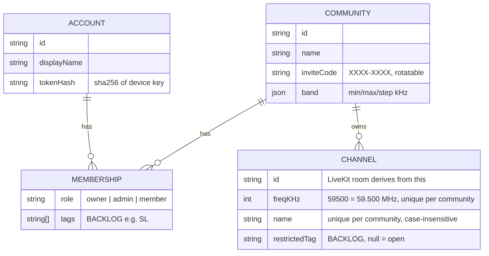

# Radio Net: scope and plan (v0.2)

*Updated Fri 9 Oct 2026, ~4:40pm NZT. v0.1 assumed fixed nets and Discord roles. v0.2 follows Tobias's answers: **frequency/name channels created in the app**, **no Discord dependency** (Discord moves to the backlog).*
*Provider comparison: [`providers.md`](providers.md) (unchanged). UI direction: [`UI.md`](UI.md) + [`mockup.html`](mockup.html). M1 spike: [`spike/README.md`](../spike/README.md). Sydney deploy kit: [`../deploy/README.md`](../deploy/README.md). Anti-cheat notes: [`anticheat-and-contacts.md`](anticheat-and-contacts.md).*

## 1. The one-paragraph version

**Radio Net** (working name) is a small **Windows desktop app** that runs beside WARDOGS or any game. A group creates a **community** in the app and shares an **invite code**; members join with the code and a display name. No Discord, email or password. Community **admins create and delete channels**, each a **frequency + name** (e.g. `59.500 Command`). Every user has their own **radio**: tune any number of channels to **listen** (type `59.5` or `command`), each with its own **volume and left/centre/right ear**, and pick **one to transmit** on. **Push-to-talk** talks on the TX channel. A **channel-wheel** hotkey (default `G`, Arma Reforger style) opens a radial menu centred on the screen. Hover a segment, left-click to make it the transmit channel, right-click to mute or unmute, scroll to step that frequency by 25 kHz (30.000–87.975 MHz), Shift+scroll to change that channel’s volume, and use the **+** segment to add a channel by frequency or name. The wheel takes mouse focus briefly. The fallback, which does not need that focus, is hold `G` and scroll or press a number key. Release or Esc closes. Push-to-talk stays its own key. See [`radial-wheel.png`](radial-wheel.png). A click-through **overlay** is on by default: a small box in a screen corner that stays empty when nobody is transmitting, and while someone transmits shows only their display name and the channel (frequency + name) they are transmitting on, stacked if several people are talking. Voice runs on **self-hosted LiveKit** in Sydney. Clean voice, no radio effects.

## 2. What changed from v0.1

| Area | v0.1 | v0.2 |
|---|---|---|
| Channels | Fixed nets (Command/Arty/Logi/FT-1..4) in a server config file | **Admins create/delete channels in-app**: frequency (30.000–87.975 MHz, 25 kHz steps) + name. Fireteams are just ad-hoc frequencies. |
| Who hears what | Discord roles per net | **MVP: anyone in the community can tune and talk on any channel.** Per-channel restriction is backlog. |
| Accounts | Sign in with Discord | **Own lightweight accounts: invite code + display name → device key** (see §4). Discord login is backlog. |
| Admins | Discord roles | **Owner** (creator of the community) promotes **admins**. Admins: create/delete channels, rotate invite, remove members. |
| Discord dev app | Needed for M2 | **Not needed for MVP.** [`discord-setup.md`](discord-setup.md) kept for later. |

## 3. Data model

- **Frequencies are stored as integer kHz** (no float bugs). Input accepts `59.5`, `59.500`, `59.5 MHz`, `59500`. Default band 30.000–87.975 MHz in 25 kHz steps (like military VHF sets). Configurable per community.
- **User radio state stays on the client** (per community: tuned channel ids, TX channel, per-channel volume/pan/mute, keybinds). The server doesn't need it. Syncing it across PCs is backlog.
- **Storage:** SQLite on the VPS for M2 (one file, nightly backup). The spike uses an in-memory store behind the same interface.

## 4. Accounts without Discord (decision)

**Picked: invite code + display name → per-device secret key.**

1. Owner creates a community (needs a **server setup code** we set on the VPS, so strangers can't use our server).
2. They share the invite code (`K7QM-2XPA`) in their Discord/WhatsApp.
3. A member types the code + a callsign. The server creates an account and returns a **random 256-bit device key** once. The app stores it in **Windows' encrypted storage** (DPAPI via Electron `safeStorage`). The server stores only its SHA-256 hash.
4. Every request uses that key as a bearer token. One account can be in several communities.

**Why this over the alternatives:**
- **Email magic link** needs an email provider sign-up, deliverability and a mail template, plus friction for gamers. Not worth it for one small group.
- **Username + password** means password hashing, resets and "I forgot my password" with no email to reset to. More code and more support for no real gain.
- **Invite code + device key** is one screen and zero third parties. It's as strong as the key (256-bit, never typed). The invite code is only a door: joins are **rate-limited** per IP, admins can **rotate** it, and can **remove** anyone (who is also dropped from voice immediately).
- **Trade-offs (accepted):** a new PC = rejoin with a new account (backlog: admin-issued one-time **recovery code** to move an account). Display names aren't unique. Admins can see who's who.

## 5. Server API (Node/TypeScript + Fastify; spike implements all of these)

| Method | Path | Who | What |
|---|---|---|---|
| POST | `/api/communities` | anyone with setup code | Create community; caller = owner. First-time users pass `displayName` and get their device key back. |
| POST | `/api/join` | anyone (rate-limited) | `{inviteCode, displayName}` → membership (+ device key if new). |
| GET / PATCH | `/api/me` | signed in | My account + communities (+ invite code if admin) / change display name. |
| POST | `/api/communities/:cid/invite/rotate` | admin | New invite code; old one stops working. |
| GET | `/api/communities/:cid/members` | member | Member list with roles. |
| PATCH | `/api/communities/:cid/members/:aid` | owner | Make admin / member. |
| DELETE | `/api/communities/:cid/members/:aid` | admin (or self = leave) | Remove member + kick from all voice rooms. |
| GET | `/api/communities/:cid/channels` | member | Channel list, sorted by frequency. |
| GET | `/api/communities/:cid/channels/resolve?q=` | member | `59.5` / `41.250 MHz` / `command` / unique prefix `comm` → channel. |
| POST | `/api/communities/:cid/channels` | admin | `{freq, name}`. 409 if frequency or name already used. |
| DELETE | `/api/communities/:cid/channels/:chid` | admin | Delete + LiveKit `DeleteRoom` (everyone tuned is dropped). |
| POST | `/api/communities/:cid/radio/tokens` | member | `{channelIds[]}` → one LiveKit token per channel. |

Backlog: a push channel (SSE/WebSocket) so channel list changes appear instantly. MVP polls every 10 s.

## 6. How channels map to LiveKit (decision)

- **1 channel = 1 LiveKit room**, named `g{communityId}.ch{channelId}`. Keyed on the channel **id**, so deleting `59.500` and recreating it later gives a fresh, empty room.
- The client opens **one LiveKit connection per tuned channel** (tested with 2 rooms per client; up to 16 allowed by the API). Each room's audio goes through its own **gain + stereo-pan** node.
- **Token grants per room:** `roomJoin`, `canSubscribe: true`, `canPublish: true` **microphone only** (`canPublishSources: [microphone]`), `canPublishData: false`, 10-minute join TTL.
- **Transmit:** the app pre-publishes a **muted** mic track in each tuned room. PTT **un-mutes only the TX room**. Changing TX (channel wheel) is instant: no reconnect, no renegotiation.
- **What the server enforces vs the client:** the server enforces *who may* hear/talk on a channel (tokens), and that only mic audio can be sent. "Only one TX at a time" is a UX rule enforced by the app. That's fine while everyone can talk everywhere. When restricted channels arrive (backlog), the token simply won't grant publish/subscribe on them. Spike proves LiveKit refuses to publish with a listen-only token.

## 7. Client UX (see [`UI.md`](UI.md), [`mockup.html`](mockup.html))

- **First run:** "Join your net" (invite code + callsign) or "Create a community" (name + setup code).
- **Main window:** community rail (left) → community's channel list with a **Tune** box ("59.5 or Command", Enter) and admin **+ New / delete** → **radio** area: a big **"Transmit on 59.500 Command"** bar (turns red "On air" while keyed) and a **card per tuned channel**: frequency, name, who's talking, volume + mute, **L/C/R ear**, "Transmit here", untune ×.
- **Keys (decision, 9 Oct 2026):** one **push-to-talk** key (spike default `Mouse 4`), plus a **channel-wheel** hotkey (default `G`, Arma Reforger style). Hide overlay stays `F10`. Confirmation blips on key-up/down and on a channel change (not a radio effect; can be turned off). Picture: [`radial-wheel.png`](radial-wheel.png).
  - **Open.** Hold or press `G`. The wheel is a ring of segments centred on the screen, one per tuned channel (lowest frequency is CH1 at 12 o’clock, then clockwise) plus a final **+** segment. A short press latches it open. Holding and releasing closes it. `Esc`, or `G` again while it is latched, also closes it. While the add field is open, `G` does not dismiss the wheel, so a name can be typed.
  - **Each channel segment** shows its label (`CH1`), frequency (`41.250 MHz`), and the channel name. A green dot means that channel is live and not muted. The transmit segment uses a gold label and a speaker icon. A muted segment is grey, with a mute icon and no green dot. A frequency with no community channel on it shows the dialled frequency and “no net”.
  - **Hover** selects a segment. **Left-click** makes it the active transmit channel (only if you can talk on it). **Right-click** mutes or unmutes it. **Scroll** changes that segment’s frequency in 25 kHz steps, staying inside 30.000–87.975 MHz. Scrolling off a channel untunes it; scrolling onto a community channel tunes it. Two segments cannot sit on the same channel. **Shift+scroll** raises or lowers that channel’s volume (5% steps, 0–150%) and shows a volume bar and percentage on the segment. The bar also shows while the segment is hovered.
  - **+ Add.** Left-click the last segment (it also carries the radio icon). A small field in the hole accepts a frequency or a name, same match as the main tune box: exact frequency, exact name, or a unique name prefix. That tunes an existing channel. It does not create one (admins still use + New). Adding a channel you already have just highlights that segment.
  - **Focus.** Opening the wheel expands the overlay to the full screen and focuses it, so the mouse can hover and click a segment. That takes focus from the game for this moment. On close, the corner talker box comes back and clicks pass through again. **Fallback, if that focus fights the game:** hold `G` and scroll, or press `1`–`9`. Those stay on the global input path and do not need the wheel window focused. Scroll and number keys then act on the hovered segment, otherwise the transmit segment. Push-to-talk is never this key.
  - The spike implements this on `G`. `Mouse 5` still cycles the transmit channel so the earlier smoke path keeps working. The main-window mockup ([`mockup.html`](mockup.html)) shows the Wheel keycap; the ring itself is [`radial-wheel.png`](radial-wheel.png).
- **Input capture (decision, 9 Oct 2026, not built yet):** before the Windows anti-cheat test, switch global input from the low-level hook (`uiohook-napi`, `WH_KEYBOARD_LL` / `WH_MOUSE_LL`) to Windows Raw Input (`RegisterRawInputDevices` with `RIDEV_INPUTSINK`). Lower risk: nothing sits in the input chain. Same approach as Mumble 1.4+. The spike keeps uiohook until that change. Contacts, the draft Bulkhead email, and the ranked options are in [`anticheat-and-contacts.md`](anticheat-and-contacts.md).
- **Overlay:** always on by default. A small click-through box in a screen corner. It draws nothing while nobody is transmitting. When someone transmits, it shows only that person's display name and the channel they are transmitting on (frequency + name, for example `Rhys  59.500 Command`). Several talkers stack, one line each.
- **Remembers** tuned channels, TX channel, volumes per community. Tray icon, start minimised, auto-reconnect.

## 8. Stack (unchanged except auth)

Self-hosted **LiveKit** (Sydney VPS; kit in [`../deploy/README.md`](../deploy/README.md)) · **Electron + React + TypeScript** with `livekit-client` · global input: the spike uses **uiohook-napi**; before the anti-cheat test, switch to Windows **Raw Input** (`RIDEV_INPUTSINK`), see §7 · overlay = transparent, click-through, non-focusable, always-on-top window · **Fastify** API + **SQLite** · Opus with DTX + RED, browser echo cancellation / noise suppression / auto-gain · NSIS installer + self-hosted auto-update. Reasons in v0.1 §3 still apply (see git history / `providers.md`).

## 9. Milestones (revised)

| # | Milestone | What Tobias sees | Effort (dev days) | Status |
|---|---|---|---|---|
| M0 | Setup | Plan agreed, private repo (on his OK), domain chosen | ½ | Waiting on repo OK + domain pick |
| M1 | **Spike + anti-cheat gate** | Working core on Linux (done, see §11). **Still to do on Windows:** two testers, WARDOGS focused, PTT + channel wheel, overlay visible over borderless WARDOGS, **no anti-cheat complaint**. That test uses Raw Input, not the spike's uiohook (§7). | 3–4 | **~70% done** (Linux part) |
| M2 | Real backend | Sydney VPS: LiveKit + API + SQLite, HTTPS on our domain, setup code, backups | 2–3 | |
| M3 | Pleasant UI | Mockup made real: keybind recorder, device picker + mic test, settings, tray, member/admin screens, invite rotate | 4–6 | |
| M4 | Overlay + polish | Overlay position/size/opacity, reconnects, installer, auto-update | 3–4 | |
| M5 | Test nights | 1–2 evenings with the group, fix-up pass | 2–3 | |
| | **Total** | | **~15–20 dev days ≈ 3–5 weeks part-time** | |

Dropping Discord login saves about a day in M2. In-app channel management adds about a day in M3. Net effect is roughly the same timeline.

## 10. Running cost (Tobias pays)

| Item | Cost | Notes |
|---|---|---|
| Sydney VPS (1–2 vCPU, 2–4 GB) | ~US$10–20/mo (≈ NZ$18–36) | LiveKit + API on one box |
| Domain | ~NZ$19–25/yr | See [`naming.md`](naming.md). Not bought. |
| LiveKit Cloud (fallback) | US$0 dev / US$50 mo real use | Only if self-hosting is a hassle |
| Code signing | skip for now | SmartScreen "Run anyway" note for friends |

## 11. M1 spike results (Fri 9 Oct, on the Linux box)

See [`spike/README.md`](../spike/README.md) for how to run it.

**Proven (automated, all passing):**
- API unit tests: **13/13**. Frequency parsing/validation, create/delete/list/resolve channels, duplicate freq/name → 409, admin-only actions, invite join (any case/format), invite rotation, owner promotes admin, kick, multiple communities per account, join rate-limit, setup-code gate, token grants (correct room, subscribe, mic-only publish, no data).
- Headless voice test with 4 bot "players" on a real local LiveKit server: **14/14**. Multi-room connect, listen-many/talk-one (audio arrives only on the TX channel), switch TX between channels, listen-only token can't publish (server-enforced), non-admin can't create channels, deleting a channel drops everyone tuned to it while other channels stay up. Key-up to first audio ~47 ms on localhost (not a real-world number).
- **The real Electron app** on a virtual Linux display with a fake mic, plus a bot: **8/8**. Join by invite code, tune by `59.5` and by `arty`, remote speaker shown on the right card, **global PTT via the uiohook mouse hook** (Mouse 4) keys up, **its audio reaches the bot on Command only**, release un-keys, **switch key (Mouse 5) moves TX to Arty** and audio follows. That run's overlay still drew a persistent TX line plus speakers. The overlay was changed after that run to match the decision in §7 (on by default, hidden until someone transmits, each line is display name plus channel). The Electron smoke test was not re-run after that change, and it was not re-run after the channel wheel landed.
- **Channel wheel (after that smoke run):** the spike client now opens the radial on `G` (hold to release, short press latches, Esc closes), with hover, left-click transmit, right-click mute, scroll to step frequency, Shift+scroll volume, and the **+** add field. Behaviour is covered by the client unit tests (`spike/client`, 18 tests) including one full wheel session. The wheel window taking focus, and the hold-`G` scroll/number fallback while a game is focused, are not covered by that Electron smoke run. Raw Input is still not built; the anti-cheat test should use it instead of uiohook (§7).

**Not verified (needs Windows and/or real people):**
- **Elytra anti-cheat** tolerance of input capture + overlay. This is the M1 gate. The test should use Raw Input (`RIDEV_INPUTSINK`), not the spike's low-level hook (§7, [`anticheat-and-contacts.md`](anticheat-and-contacts.md)).
- Hotkeys while **WARDOGS has focus** on Windows (and the "game run as admin" case).
- Overlay over **borderless WARDOGS** (Linux had no compositor, so true transparency wasn't checked).
- Real microphones: echo cancellation/noise suppression quality, headset vs speakers, per-ear pan by ear.
- Real network NZ → Sydney latency and packet loss. Load beyond ~5 participants.
- Windows install/SmartScreen, DPAPI token storage (code is there, untested on Windows).

**Known issues found:** Electron sometimes hangs on quit in the test harness (likely uiohook shutdown). Needs a fix in M3. In the test, a speaker can stay shown as "talking" briefly after they stop (bot doesn't send silence; real clients do, so probably fine but worth watching).

## 12. Backlog / TODO

- [ ] **Choose final app name** (ideas + domains in [`naming.md`](naming.md))
- [ ] Buy domain (Tobias's OK + card)
- [ ] **Per-channel restriction** (e.g. only members tagged `SL` can tune/talk on Command), plus listen-only channels
- [ ] **Discord integration (optional):** "Sign in with Discord", link a community to a Discord server, map roles → tags. See [`discord-setup.md`](discord-setup.md)
- [ ] Account recovery / move to a new PC (admin-issued one-time code)
- [ ] Live channel-list updates (SSE) instead of 10 s polling
- [ ] "Transmit on all tuned channels" key; priority/ducking (Command louder)
- [ ] Channel presets per op (one click tunes a set)
- [ ] Sync radio state across PCs
- [ ] Code signing if SmartScreen puts people off
- [ ] Mac/Linux builds; phone listen-only
- **Explicitly out:** radio effects, range/terrain simulation, anything that reads or hooks the game.

## 13. Questions for Tobias (short)

1. **OK to create a private GitHub repo** `radio-net` for the code and these docs? (A yes is enough.)
2. **Name/domain:** pick from [`naming.md`](naming.md) or say "keep Radio Net" (`radionetvoice.com`). I won't buy anything.
3. **Windows testers:** two people (you + one) for a short M1 test night. Happy to risk one WARDOGS account first?
