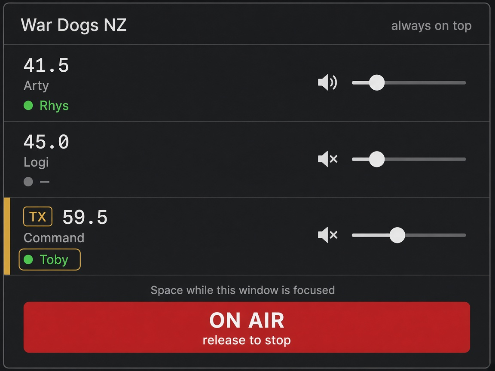

# Web app and Simple mode

Planning only. No build is part of 0.4.x. The wireframe is [`simple-mode.png`](simple-mode.png). Issues: [#7](https://github.com/Tubss2/radio-net/issues/7) (web app), [#8](https://github.com/Tubss2/radio-net/issues/8) (Simple mode).

## Summary

Radio Net can grow two things that share one playing screen. A **web app** at [https://tubss2.github.io/radio-net/](https://tubss2.github.io/radio-net/) talks to the Sydney API and LiveKit from a normal browser. A **Simple mode** is a small window for a second monitor: the channels you are on, who is talking, a volume and a mute, which channel you will transmit on, and a big push-to-talk.

**Effort.** Web v1 is about **8 dev days**. Simple mode on desktop and in that web app is about **5**. Doing both is about **11**, because the web playing screen is the simple list rather than a second copy of the full desktop window. A supported phone app is not in that number.

**Trade-offs.** The browser cannot hear a global hotkey and cannot draw the game overlay. You talk with Space or a hold button only while that tab is in front. A fullscreen game on the same monitor will not see the button. Always-on-top is a desktop window; a browser tab cannot sit above the game. The admin key and invite code in browser storage are easier to copy than the desktop profile, which the OS can encrypt. Phones can maybe listen in the foreground. They are a poor place to talk on several rooms while a game is running.

**v1 of the web app:** join with an invite, store the callsign in the browser, listen to several channels, talk on one, and let an admin create and delete channels. Simple mode is how that looks while you play. The radial wheel, the overlay, mouse-button push-to-talk, and the auto-updater stay on the desktop app.

## A. Web app on GitHub Pages

The Pages URL is the product site. The mocked UI preview that the preview workflow builds is a different thing: it never calls the API, and its Content-Security-Policy sets `connect-src 'none'`. Shipping that mock at the same URL would look like Radio Net and then fail every join. The real app is a separate static build with the Sydney URLs baked in (`https://radio-149-28-170-200.sslip.io` and `wss://lk-149-28-170-200.sslip.io`). The mock can move to `/preview/` on Pages, matching the path Sydney already serves.

GitHub Pages for this repo is not switched on yet. The preview workflow can deploy only after **Settings → Pages → Source** is **GitHub Actions**. The web app waits on that same one-time switch.

### What is already reusable

The radio itself is browser code. These pieces do not need Electron:

- `spike/client/src/renderer/src/lib/radioEngine.ts` — one LiveKit room per tuned channel, Web Audio gain and pan, microphone publish muted until push-to-talk.
- `spike/client/src/renderer/src/lib/api.ts` — join, channels, admin create/delete, token grants, reconnect.
- `spike/client/src/shared/` — frequency parsing, the profile shape, the reconnect wording.
- The React screens in `App.tsx` for callsign, join, the channel list, and the tuned cards. Simple mode replaces the card stack while playing; the join and admin list can stay.
- `bridge.ts` already has a browser fallback that reads and writes `localStorage` under `rn.profile` when `window.radionet` is missing. The preview uses a fake API. Web mode uses the real `Api` and `RadioEngine`.

Leave these on the desktop: the main process, preload, `uiohook` hotkeys, the overlay `BrowserWindow`, `electron-updater`, and the encrypted `profile.bin` in user data.

### CORS

`spike/server/src/app.ts` already registers `@fastify/cors` with `origin: true`, so any site can call the API from a browser. That was for the desktop app, which loads from `file://` and sends no useful origin. A public Pages app should allow a list instead:

- `https://tubss2.github.io`
- `http://localhost` and `http://127.0.0.1` for local dev
- a missing or `null` origin so the Electron `file://` build still works

The LiveKit signal connection is the browser talking straight to `wss://lk-149-28-170-200.sslip.io`, not through the API. LiveKit’s default allows that origin. Media stays on UDP 7882, with TCP 7881 as the fallback, same as the desktop client. No new firewall ports.

### Microphone and WebRTC

Pages is HTTPS, so `getUserMedia` is allowed. The first talk, or an explicit “enable microphone” click, has to be the user gesture that starts the mic and resumes the `AudioContext`. Autoplay will otherwise leave the rooms connected and silent. v1 asks once, then reuses the track the way `radioEngine` already does. Deny is a clear message, not a thrown error string.

### What the browser remembers

Same profile as the desktop: callsign, server list (name, URL, invite, last used), tuned channels, transmit channel, mute, volume, and the optional admin key. `localStorage` on `https://tubss2.github.io` is the store. It is per browser profile, survives restarts, and is not synced to the server. Closing the browser does not log you out unless we put the session token in `sessionStorage`. v1 does that: the 12-hour session dies with the tab, and the invite plus callsign are enough to join again. Volumes and the channel picks stay in `localStorage`.

### Push-to-talk

Only while the tab is focused. Space (the preview already does this when it is not inside Electron) and a hold button. Key-up, pointer-up, pointer leave, window blur, and `visibilitychange` to hidden all release the key. A tab you alt-tab away from must not stay on air. There is no Mouse 4, no F2 wheel, and no F10 overlay. Those need the global hook and a second window.

### Background tabs

Chrome and Edge usually keep WebRTC audio playing in a background tab, which is what you want on a second monitor if the browser window is visible but not focused. They also slow timers, so the 10-second channel refresh can lag. Firefox and Safari are more likely to suspend the audio context. If that happens, the page says the tab is asleep and a click resumes it. Transmitting always stops when the tab is hidden. Do not try to transmit from a background tab.

### Phones

A phone browser is a maybe for listening, in the foreground, on Android Chrome. iOS Safari suspends the page when you leave it or lock the screen, and several live rooms at once are a heavy tab. Touch-and-hold can be the push-to-talk button. That is worth one day of trying on a real phone and writing down what broke. It is not a v1 promise, and it is not a way to run the radio beside a game.

### Security

The desktop profile is a file in user data, mode `0600`, encrypted with the OS when Electron’s safe storage works (DPAPI on Windows). The browser store is plain text. Anyone at the machine, any extension, or any script that runs on the Pages origin can read it. DevTools shows it too.

- The invite code is the group password. Storing it is what makes “join again” one click. That is acceptable if the group treats the browser like a shared radio, and it should be mentioned on the join screen.
- The admin key can create and delete channels and delete the community. v1 does not save it unless the user ticks “keep the admin key in this browser”, with a one-line warning. A “forget key” control clears it.
- The session token is a bearer secret. `sessionStorage`, never the URL, never a log line.
- A cross-site script on the Pages origin steals all of the above. The page loads no third-party scripts. Its Content-Security-Policy allows `connect-src` only for the API host and the LiveKit host. That is the opposite of the mock preview policy.
- Tightening CORS does not hide the API. Anyone with a token can still call it. It stops some other website from calling the API with the browser user’s cookies. This API does not use cookies. The token in our own storage is the secret that matters.
- Join limiting stays per client IP behind Caddy. A web user and a desktop user on the same network share that bucket. The current limit of 30 joins a minute is enough.

### Web v1, in and out

In: callsign, join by invite, server list in the browser, tune several channels and hear them, one transmit channel, Space and a hold button while the tab is focused, admin create and delete channel when the key is present, reconnect wording that already exists, Simple mode as the playing view.

Out: global hotkeys, overlay, radial wheel, per-ear pan (the full desktop cards keep it), auto-update, a supported phone client, accounts.

### Effort (web)

| Slice | Dev days |
|---|---|
| Real browser build (API + LiveKit, not the mock preview) and hiding Electron-only controls | 3 |
| Pages workflow, baked Sydney URLs, CSP, mock moved off the site root | 1 |
| CORS allowlist that still lets the `file://` app through | 0.5 |
| Mic gesture, audio unlock, push-to-talk release on blur and hide | 1.5 |
| Storage split (local settings vs session token) and the admin-key warning | 1 |
| Background-tab pass on Chrome and Edge, plus a one-day phone note | 1 |
| **Web v1** | **8** |

## B. Simple mode

A layout for a second monitor, in the desktop app and in the web app. It stays up while the full radio window, or the browser’s other tabs, can be elsewhere. It is not the overlay: the overlay is an empty click-through box until someone transmits, and it has no controls. Simple mode is a real window you can click.

The picture is the on-air state. Top to bottom:

- Community name, and on desktop a note that the window is always on top.
- One row per tuned channel: frequency and name (`41.5 Arty`, `45.0 Logi`, `59.5 Command`).
- Who is talking on that channel right now. The callsign is highlighted. In the picture Rhys is talking on Arty, and Toby (you) is highlighted on Command.
- Mute and a volume slider on each row.
- The transmit channel is marked **TX**. That is the row the big button will key.
- A large push-to-talk control. Idle copy is hold-to-talk. While keyed it is **ON AIR**, as drawn. Space does the same thing while this window or tab is focused.

Untune, ear pan, the wheel, and channel creation stay on the full radio. Simple mode needs a small way to change the TX row (click the row) and a link back to the full window for everything else. Admin channel management is not crammed into this list.

### Desktop window

A separate small `BrowserWindow`, or the main window switched into this layout. Resizable, with a sensible minimum around the width of the wireframe. Optional always-on-top, remembered with the window size and position in the local profile. It is a normal window: it takes focus when you click it, which is how Space and the button work. It does not click through, and it does not cover the game unless you put it on the other screen or tick always-on-top on the same screen.

The global Mouse 4 push-to-talk still works in the desktop app while the game is focused. Simple mode does not replace that. It adds a visible button for when you are looking at the second monitor.

### Web

The same list and the same button. There is no always-on-top and no global hotkey. You park the browser on the second monitor. If the tab is visible but not focused, audio can keep playing (see background tabs above) and the button will not key until you click the window. Space works after that click.

### Effort (simple mode)

| Slice | Dev days |
|---|---|
| The list: rows, talkers, mute, volume, TX mark, big button, shared by desktop and web | 2.5 |
| Desktop: small resizable window, always-on-top, remember bounds | 1.5 |
| Wire it into the web playing view | 1 |
| **Simple mode** | **5** |

Together with web v1, about **11 dev days**. Building the full three-column desktop UI again for the browser, and then also building this list, would be the 8 plus extra screen work on top.

### Trade-offs

- Second monitor is the point. On one monitor, a fullscreen game covers this window, and always-on-top fights the game for the screen.
- The list shows tuned channels only. Picking a new frequency is a trip back to the full radio or the web channel list.
- Highlighting every talker on a busy net will make a tall window. v1 shows the names and lets the window scroll. It does not summarise a crowd into “3 others”.
- Always-on-top on desktop can cover a click the player needed. It is off unless they turn it on.
